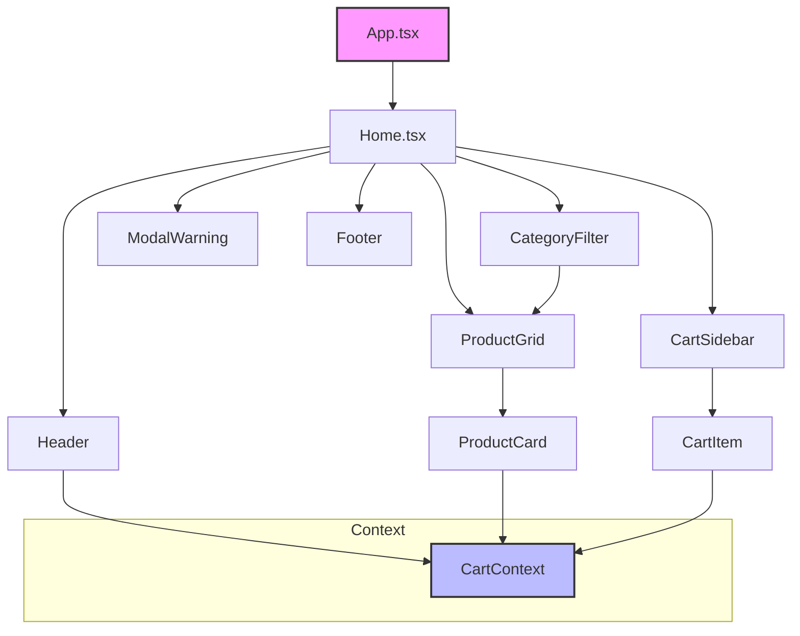

# Shopping Cart Component Migration Design

## Overview

This design document outlines the migration of an existing HTML/JavaScript shopping cart application to a React-based component architecture within the IFMAIS project. The migration involves extracting and converting existing functionality into reusable React components with proper state management and modern patterns.

### Project Context
- **Current State**: HTML/CSS/JavaScript implementation with manual DOM manipulation
- **Target State**: React component-based architecture with TypeScript
- **Key Focus**: Maintaining existing functionality while improving maintainability and scalability

## Technology Stack & Dependencies

### Core Technologies
- **React**: Component-based UI framework
- **TypeScript**: Type safety and enhanced development experience
- **Vite**: Build tool and development server
- **Tailwind CSS**: Utility-first styling framework

### Additional Dependencies Required
- **class-variance-authority (cva)**: Component variant management (already installed)
- **@radix-ui/react-slot**: Component composition patterns (already installed)
- **shadcn/ui**: Pre-built accessible UI components
- **tailwind-merge & clsx**: Class name utilities (already installed)
- **React Context API**: Global state management for cart functionality

## Component Architecture

### Component Hierarchy



### Component Definitions

#### 1. Header Component
**Purpose**: Top navigation with logo and cart indicator
**Props Interface**:
```typescript
interface HeaderProps {
  className?: string;
}
```
**Key Features**:
- Logo display
- Cart icon with item count badge
- Responsive design
- Integration with CartContext for real-time updates

#### 2. CartSidebar Component
**Purpose**: Side panel for cart management
**Props Interface**:
```typescript
interface CartSidebarProps {
  isOpen: boolean;
  onClose: () => void;
}
```
**Key Features**:
- Slide-in/out animation
- Cart items list rendering
- Total calculation display
- Checkout button
- Empty cart state handling

#### 3. CartItem Component
**Purpose**: Individual cart item representation
**Props Interface**:
```typescript
interface CartItemProps {
  item: CartItemType;
  onUpdateQuantity: (id: string, quantity: number) => void;
  onRemove: (id: string) => void;
}
```
**Key Features**:
- Product image display
- Title and price information
- Quantity controls (+/- buttons)
- Remove item functionality
- Real-time price calculation

#### 4. CategoryFilter Component
**Purpose**: Product category filtering controls
**Props Interface**:
```typescript
interface CategoryFilterProps {
  categories: Category[];
  activeCategory: string;
  onCategoryChange: (category: string) => void;
}
```
**Key Features**:
- Button group for categories (Todos, Doces, Salgados, Bebidas, Sobremesas)
- Active state management
- Responsive button layout

#### 5. ProductGrid Component
**Purpose**: Product display grid with filtering
**Props Interface**:
```typescript
interface ProductGridProps {
  products: Product[];
  activeCategory: string;
}
```
**Key Features**:
- Responsive grid layout
- Category-based filtering
- Product card rendering
- Loading states

#### 6. ProductCard Component
**Purpose**: Individual product display and add-to-cart functionality
**Props Interface**:
```typescript
interface ProductCardProps {
  product: Product;
  onAddToCart: (product: Product) => void;
}
```
**Key Features**:
- Product image display
- Title and price information
- Add to cart button
- Hover effects and interactions

#### 7. ModalWarning Component
**Purpose**: Warning dialogs for user feedback
**Props Interface**:
```typescript
interface ModalWarningProps {
  isOpen: boolean;
  onClose: () => void;
  message: string;
  type?: 'warning' | 'error' | 'info';
}
```
**Key Features**:
- Overlay backdrop
- Configurable message content
- Close button functionality
- Escape key handling

#### 8. Footer Component
**Purpose**: Application footer content
**Props Interface**:
```typescript
interface FooterProps {
  className?: string;
}
```
**Key Features**:
- Static content display
- Responsive layout
- Future extensibility for dynamic content

### State Management Architecture

#### CartContext Implementation

```mermaid
graph LR
    CartContext --> CartState[Cart State]
    CartContext --> CartActions[Cart Actions]
    
    CartState --> Items[items: CartItem[]]
    CartState --> Total[total: number]
    CartState --> IsOpen[isOpen: boolean]
    
    CartActions --> AddToCart[addToCart]
    CartActions --> RemoveFromCart[removeFromCart]
    CartActions --> UpdateQuantity[updateQuantity]
    CartActions --> ClearCart[clearCart]
    CartActions --> ToggleCart[toggleCart]
    
    style CartContext fill:#bbf,stroke:#333,stroke-width:2px
```

**CartContext Interface**:
```typescript
interface CartContextType {
  // State
  items: CartItem[];
  total: number;
  isOpen: boolean;
  
  // Actions
  addToCart: (product: Product) => void;
  removeFromCart: (itemId: string) => void;
  updateQuantity: (itemId: string, quantity: number) => void;
  clearCart: () => void;
  toggleCart: () => void;
}
```

**Key Features**:
- Centralized cart state management
- localStorage persistence
- Automatic total calculation
- Side effects handling with useEffect
- Type-safe operations

### Data Models

#### Product Interface
```typescript
interface Product {
  id: string;
  title: string;
  price: number;
  image: string;
  category: 'doces' | 'salgados' | 'bebidas' | 'sobremesas';
}
```

#### CartItem Interface
```typescript
interface CartItem {
  id: string;
  product: Product;
  quantity: number;
  subtotal: number;
}
```

#### Category Interface
```typescript
interface Category {
  id: string;
  name: string;
  label: string;
}
```

## Styling Strategy

### CSS Architecture
- **Current**: Global CSS with manual class management
- **Target**: Tailwind CSS utility classes with shadcn/ui components
- **Pattern**: Utility-first approach leveraging existing design system
- **No CSS Modules**: Pure Tailwind classes and shadcn/ui component styling

### Component Styling Patterns
Following the existing button component pattern with shadcn/ui:
```typescript
// Using existing button variants from shadcn/ui
const cardVariants = cva(
  "rounded-lg border bg-card text-card-foreground shadow-sm",
  {
    variants: {
      size: {
        default: "p-6",
        sm: "p-4",
        lg: "p-8"
      },
      variant: {
        default: "border-border",
        elevated: "shadow-lg",
        outlined: "border-2"
      }
    },
    defaultVariants: {
      size: "default",
      variant: "default"
    }
  }
)
```

### Shadcn/UI Integration
- **Leverage existing components**: Button, Card, Badge, Modal components from shadcn/ui
- **Consistent design tokens**: Using CSS variables and design system tokens
- **Accessibility built-in**: Shadcn/ui components include ARIA attributes and keyboard navigation

## Application Structure

### File Organization

```
src/
├── components/
│   ├── ui/
│   │   ├── button.tsx              # Existing shadcn/ui component
│   │   ├── card.tsx                # Shadcn/ui card component (to be added)
│   │   ├── dialog.tsx              # Shadcn/ui modal component (to be added)
│   │   ├── badge.tsx               # Shadcn/ui badge component (to be added)
│   │   └── sheet.tsx               # Shadcn/ui sheet component for sidebar (to be added)
│   ├── layout/
│   │   ├── Header.tsx
│   │   └── Footer.tsx
│   ├── cart/
│   │   ├── CartSidebar.tsx
│   │   └── CartItem.tsx
│   ├── product/
│   │   ├── ProductGrid.tsx
│   │   ├── ProductCard.tsx
│   │   └── CategoryFilter.tsx
│   └── common/
│       └── ModalWarning.tsx
├── context/
│   └── CartContext.tsx
├── data/
│   ├── products.ts                 # Product data (no compilation needed)
│   └── categories.ts               # Category definitions
├── hooks/
│   ├── useCart.ts                  # Cart-related custom hooks
│   └── useLocalStorage.ts          # LocalStorage persistence hook
├── types/
│   ├── product.ts                  # Product type definitions
│   └── cart.ts                     # Cart type definitions
├── lib/
│   └── utils.ts                    # Existing utility functions (cn, etc.)
├── pages/
│   ├── Home.tsx                    # Main shopping page
│   ├── MainApp.tsx                 # Existing main app
│   └── PageNotFound.tsx            # Existing 404 page
├── App.tsx
└── main.tsx
```

## API Integration Layer

### Current Data Source
- **Current**: Static HTML with JavaScript arrays
- **Migration**: TypeScript data files with proper typing

### Future API Integration Points
```typescript
// Future API service structure
interface ProductService {
  getProducts(): Promise<Product[]>;
  getProductsByCategory(category: string): Promise<Product[]>;
  getProductById(id: string): Promise<Product>;
}

interface OrderService {
  submitOrder(order: Order): Promise<OrderResponse>;
  getOrderStatus(orderId: string): Promise<OrderStatus>;
}
```

## Testing Strategy

### Component Testing Approach
- **Unit Tests**: Individual component testing with Jest and React Testing Library
- **Integration Tests**: Context provider and component interaction testing
- **E2E Tests**: Critical user flows (add to cart, checkout process)

### Key Testing Scenarios
1. **Cart Operations**:
   - Add product to cart
   - Update item quantity
   - Remove item from cart
   - Clear entire cart

2. **Category Filtering**:
   - Filter products by category
   - Display all products
   - Handle empty filter results

3. **Modal Interactions**:
   - Display warning when cart is empty
   - Close modal on button click
   - Close modal on escape key

4. **Persistence**:
   - Cart state persistence in localStorage
   - Cart state restoration on page reload

### Testing File Structure
```
src/
├── __tests__/
│   ├── components/
│   │   ├── Header.test.tsx
│   │   ├── CartSidebar.test.tsx
│   │   ├── ProductCard.test.tsx
│   │   └── CategoryFilter.test.tsx
│   ├── context/
│   │   └── CartContext.test.tsx
│   └── utils/
│       └── cart-utils.test.tsx
```

## Migration Implementation Plan

### Phase 1: Shadcn/UI Setup
1. Add required shadcn/ui components (Card, Dialog, Badge, Sheet)
2. Set up TypeScript interfaces and types
3. Create basic component structure using shadcn/ui primitives
4. Implement CartContext with basic functionality

### Phase 2: Core Components with Shadcn/UI
1. Migrate Header component using shadcn/ui Badge for cart count
2. Implement ProductCard using shadcn/ui Card component
3. Create ProductGrid with responsive Tailwind grid classes
4. Implement CategoryFilter with shadcn/ui Button variants

### Phase 3: Cart Management with Shadcn/UI
1. Implement CartSidebar using shadcn/ui Sheet component
2. Create CartItem component with shadcn/ui Button controls
3. Add cart persistence with localStorage hooks
4. Implement ModalWarning using shadcn/ui Dialog component

### Phase 4: Enhancement & Testing
1. Refine responsive design with Tailwind utilities
2. Implement comprehensive testing suite
3. Performance optimization
4. Accessibility validation (built into shadcn/ui)

### Phase 5: Integration & Deployment
1. Integrate all components in main React application
2. Final testing and bug fixes
3. Documentation updates
4. React app deployment (no compilation needed for data files)