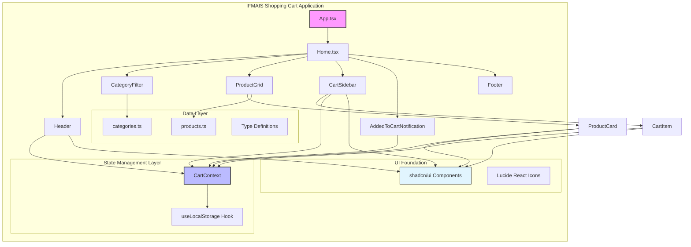
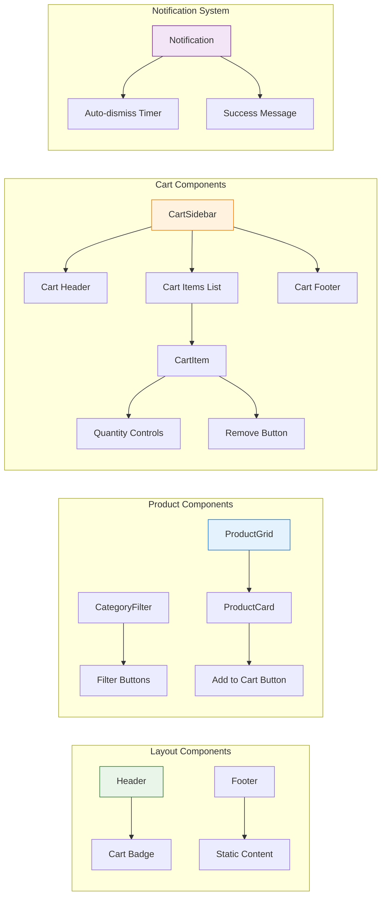
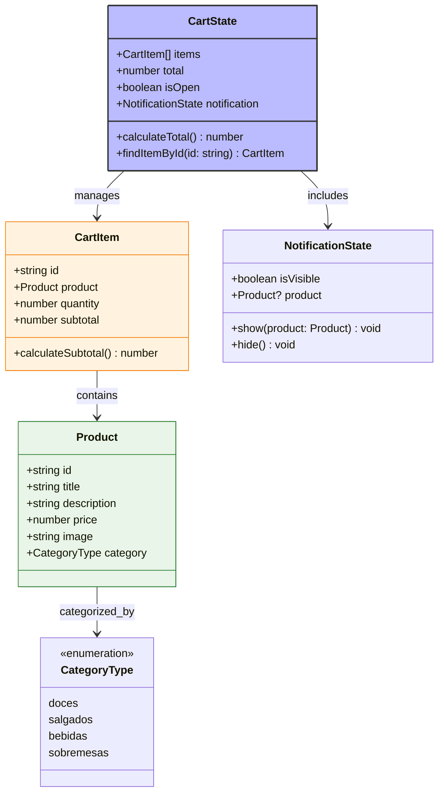
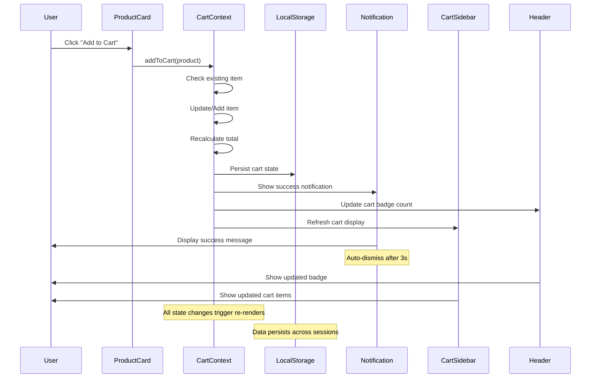
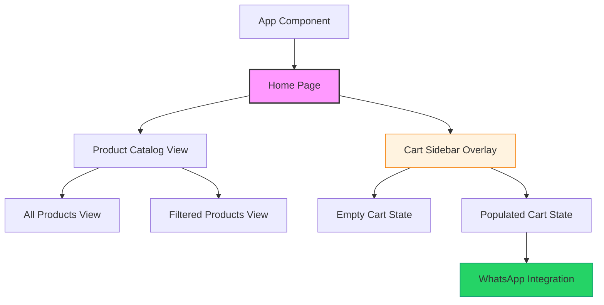
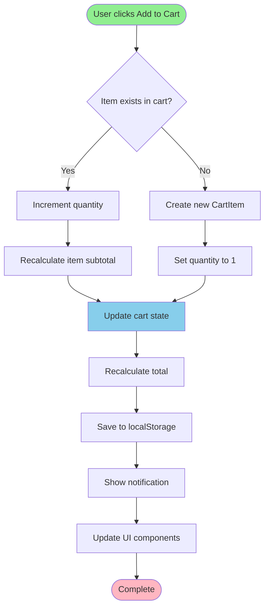
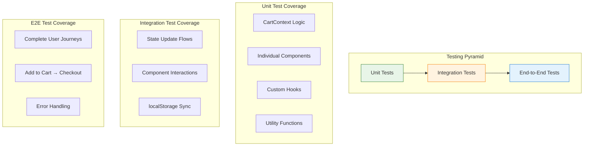

# Shopping Cart UI Enhancement - Design Document

## Overview

This document outlines the design for enhancing the IFMAIS shopping cart application, a React-based digital menu system for the "If Mais Empreendedor" initiative. The application provides a comprehensive e-commerce experience with product browsing, cart management, and order processing through an intuitive web interface.

### Project Context
- **Application Type**: Frontend React Application
- **Current State**: Fully implemented with comprehensive cart functionality
- **Target Users**: Entrepreneurs and participants in the "If Mais Empreendedor" program
- **Primary Goal**: Provide seamless digital shopping experience with enhanced UI/UX

## Technology Stack & Dependencies

### Core Technologies
- **React 18+**: Component-based UI framework with hooks
- **TypeScript 5+**: Type safety and enhanced development experience
- **Vite 5+**: Build tool and development server
- **Tailwind CSS 3+**: Utility-first styling framework

### UI Component Library
- **shadcn/ui**: Pre-built accessible UI components
  - Sheet: Slide-out cart sidebar
  - Button: Interactive controls with variants
  - Badge: Cart item count display
  - Card: Product display containers
  - Dialog: Modal interactions
- **@radix-ui/react-***: Headless UI primitives
- **class-variance-authority (cva)**: Component variant management
- **Lucide React**: Icon library for UI elements

### State Management & Persistence
- **React Context API**: Global cart state management
- **Custom useLocalStorage Hook**: Data persistence across sessions
- **TypeScript Interfaces**: Type-safe data structures

## Component Architecture

### System Architecture Diagram



### Component Hierarchy & Relationships



### Component Definitions

#### 1. CartContext - State Management Hub
**Purpose**: Centralized state management for all cart operations
**Interface**:
```typescript
interface CartContextType {
  // State
  items: CartItem[];
  total: number;
  isOpen: boolean;
  notification: { isVisible: boolean; product?: Product };
  
  // Actions
  addToCart: (product: Product) => void;
  removeFromCart: (itemId: string) => void;
  updateQuantity: (itemId: string, quantity: number) => void;
  clearCart: () => void;
  toggleCart: () => void;
  hideNotification: () => void;
}
```

**Key Features**:
- Automatic total calculation
- localStorage persistence via useLocalStorage hook
- Notification state management
- Type-safe operations with comprehensive error handling

#### 2. CartSidebar - Main Cart Interface
**Purpose**: Slide-out panel for comprehensive cart management using shadcn/ui Sheet
**Implementation**: Uses Sheet component with custom close button and responsive layout

**Key Features**:
- Sheet-based slide-out animation
- Custom orange close button with X icon
- Responsive height constraints: `max-h-[40vh] sm:max-h-[50vh] md:max-h-[60vh] lg:max-h-120`
- WhatsApp integration for order processing
- Empty cart state handling
- Scrollable items container with overflow-y-auto

#### 3. CartItem - Individual Item Management
**Purpose**: Display and control individual cart items
**Props Interface**:
```typescript
interface CartItemProps {
  item: CartItemType;
}
```

**Key Features**:
- Product image display (16x16 rounded container)
- Quantity controls using shadcn/ui Button with outline variant
- Orange-themed increment/decrement buttons
- Red remove button with ghost variant
- Real-time subtotal calculation

#### 4. AddedToCartNotification - User Feedback
**Purpose**: Immediate visual feedback when items are added to cart
**Props Interface**:
```typescript
interface AddedToCartNotificationProps {
  product?: Product;
  isVisible: boolean;
  onClose: () => void;
}
```

**Key Features**:
- Fixed positioning: `top-24 left-1/2 transform -translate-x-1/2`
- Auto-dismiss after 3 seconds
- Slide-in animation: `animate-in slide-in-from-top-2 duration-300`
- Green checkmark icon from Lucide React
- Product-specific success messaging

#### 5. Header - Navigation & Cart Access
**Purpose**: Top navigation with logo and cart access
**Key Features**:
- Fixed sticky positioning: `sticky top-0 z-50`
- Cart badge display using shadcn/ui Badge
- Real-time cart count updates
- Orange color theme consistency

#### 6. ProductCard - Product Display
**Purpose**: Individual product presentation using shadcn/ui Card
**Key Features**:
- Card component with shadow styling
- Product image flush with card top (pt-0 removal)
- Add to cart button integration
- Price formatting and display
- Hover effects and interactions

#### 7. CategoryFilter - Product Filtering
**Purpose**: Category-based product filtering interface
**Key Features**:
- Button group using shadcn/ui Button variants
- Orange active state styling: `bg-orange-500`
- Categories: Todos, Doces, Salgados, Bebidas, Sobremesas
- Responsive button layout

## Data Models & Type Definitions

### Core Data Structures



### Business Logic Flow



## Routing & Navigation

### Navigation Structure


**Key Navigation Features**:
- Single-page application with component-based routing
- Cart sidebar overlay accessible from any view
- Category filtering maintains current page state
- Persistent cart state across navigation

## Styling Strategy

### Design System Implementation
- **Framework**: Tailwind CSS with shadcn/ui component library
- **Theme**: Orange-based color scheme (`bg-orange-500`, `hover:bg-orange-600`)
- **Typography**: Tailwind typography utilities
- **Spacing**: Consistent padding and margin patterns
- **Shadows**: shadcn/ui shadow utilities for depth

### Component Styling Patterns
```css
/* Button Styling Pattern */
.cart-button {
  @apply bg-orange-500 hover:bg-orange-600 text-white rounded-full py-3 text-lg font-medium;
}

/* Card Container Pattern */
.product-card {
  @apply rounded-lg border bg-card text-card-foreground shadow-sm p-0;
}

/* Notification Pattern */
.notification {
  @apply fixed top-24 left-1/2 transform -translate-x-1/2 z-50 animate-in slide-in-from-top-2 duration-300;
}
```

### Responsive Design Approach
- **Mobile-first**: Tailwind responsive utilities
- **Breakpoints**: sm (640px), md (768px), lg (1024px), xl (1280px)
- **Cart Responsive Heights**: `max-h-[40vh] sm:max-h-[50vh] md:max-h-[60vh] lg:max-h-96`
- **Touch-friendly**: Minimum 44px touch targets for mobile

## State Management

### React Context Architecture

```mermaid
graph TB
    subgraph "CartContext Provider"
        State[Cart State]
        Actions[Cart Actions]
        Effects[Side Effects]
    end
    
    subgraph "State Properties"
        Items[items: CartItem[]]
        Total[total: number]
        IsOpen[isOpen: boolean]
        Notification[notification: NotificationState]
    end
    
    subgraph "Action Methods"
        AddToCart[addToCart]
        RemoveFromCart[removeFromCart]
        UpdateQuantity[updateQuantity]
        ClearCart[clearCart]
        ToggleCart[toggleCart]
        HideNotification[hideNotification]
    end
    
    subgraph "Side Effects"
        LocalStorageSync[localStorage Sync]
        TotalCalculation[Total Recalculation]
        NotificationTimer[Notification Auto-hide]
    end
    
    State --> Items
    State --> Total
    State --> IsOpen
    State --> Notification
    
    Actions --> AddToCart
    Actions --> RemoveFromCart
    Actions --> UpdateQuantity
    Actions --> ClearCart
    Actions --> ToggleCart
    Actions --> HideNotification
    
    Effects --> LocalStorageSync
    Effects --> TotalCalculation
    Effects --> NotificationTimer
    
    style State fill:#bbf,stroke:#333,stroke-width:2px
    style Actions fill:#e8f5e8,stroke:#2e7d32
    style Effects fill:#fff3e0,stroke:#f57c00
```

### State Update Patterns

#### Add to Cart Flow


### Data Persistence Strategy
- **Storage Method**: Browser localStorage
- **Sync Pattern**: Automatic synchronization on state changes
- **Error Handling**: Graceful fallback for localStorage failures
- **Data Format**: JSON serialization of CartItem arrays

## API Integration Layer

### Current Implementation
- **Data Source**: Static TypeScript files (products.ts, categories.ts)
- **State Management**: Client-side React Context
- **Persistence**: Browser localStorage

### Future API Integration Points
```typescript
// Prepared interfaces for backend integration
interface ProductService {
  getProducts(): Promise<Product[]>;
  getProductsByCategory(category: string): Promise<Product[]>;
  getProductById(id: string): Promise<Product>;
}

interface OrderService {
  submitOrder(orderData: OrderRequest): Promise<OrderResponse>;
  getOrderStatus(orderId: string): Promise<OrderStatus>;
}

interface CartService {
  syncCart(cartItems: CartItem[]): Promise<void>;
  validateCartItems(items: CartItem[]): Promise<ValidationResult>;
}
```

### WhatsApp Integration
- **Current Implementation**: Direct URL generation with order details
- **Message Format**: Structured text with item details and total
- **Phone Number**: Configurable contact number
- **URL Pattern**: `https://wa.me/${phoneNumber}?text=${encodeURIComponent(message)}`

## Testing Strategy

### Component Testing Approach


### Key Testing Scenarios

#### 1. Cart Operations Testing
- Add product to empty cart
- Add existing product (quantity increment)
- Update item quantity manually
- Remove individual items
- Clear entire cart
- Persist cart across page reload

#### 2. UI Interaction Testing
- Category filter functionality
- Cart sidebar open/close
- Notification display and auto-dismiss
- Responsive design validation
- Touch interaction testing

#### 3. State Management Testing
- Context provider initialization
- State updates trigger re-renders
- localStorage synchronization
- Error handling for storage failures

### Testing Tools & Configuration
- **Unit Testing**: Jest + React Testing Library
- **Component Testing**: @testing-library/react
- **E2E Testing**: Cypress or Playwright
- **Mock Data**: Test fixtures for products and categories
- **Accessibility Testing**: @testing-library/jest-dom

## Security Considerations

### Client-Side Security
- **Data Storage**: Only non-sensitive cart data in localStorage
- **XSS Prevention**: React's built-in protection + input validation
- **Content Security Policy**: Restrict external resources
- **Image Sources**: Validate and sanitize product image URLs

### Integration Security
- **WhatsApp Links**: URL encoding to prevent injection
- **Future API Calls**: HTTPS-only communication
- **Authentication**: Prepared for JWT token integration
- **Data Validation**: Client and server-side validation

## Performance Optimization

### React Performance Patterns
- **Memoization**: useMemo for expensive calculations
- **Component Optimization**: React.memo for pure components
- **Effect Dependencies**: Careful useEffect dependency arrays
- **State Updates**: Batch state updates where possible

### Bundle Optimization
- **Code Splitting**: Dynamic imports for route components
- **Tree Shaking**: ES modules for optimal bundling
- **Asset Optimization**: Image compression and lazy loading
- **CDN Integration**: Prepared for static asset CDN

### Runtime Performance
- **Virtual Scrolling**: For large product lists (future enhancement)
- **Debounced Search**: For product filtering (future enhancement)
- **Image Lazy Loading**: Progressive image loading
- **Local Caching**: localStorage for data persistence

## Accessibility Features

### WCAG 2.1 AA Compliance
- **Keyboard Navigation**: Full keyboard accessibility
- **Screen Reader Support**: Proper ARIA labels and roles
- **Color Contrast**: Sufficient contrast ratios
- **Focus Management**: Logical focus flow

### shadcn/ui Accessibility Benefits
- **Built-in ARIA**: Components include proper ARIA attributes
- **Keyboard Support**: Full keyboard navigation
- **Focus Indicators**: Clear focus states
- **Screen Reader Labels**: Descriptive labels for assistive technology

### Implementation Details
- **Skip Links**: Navigation shortcuts for screen readers
- **Alt Text**: Descriptive alt text for product images
- **Form Labels**: Proper labeling for form controls
- **Error Messages**: Clear error communication
- **Dynamic Content**: Announcements for state changes

## Deployment Considerations

### Build Configuration
- **Vite Build**: Optimized production builds
- **Environment Variables**: Configuration for different environments
- **Asset Optimization**: Minification and compression
- **Source Maps**: Debug information for production

### Hosting Requirements
- **Static Hosting**: CDN-friendly static asset serving
- **HTTPS**: Secure communication requirement
- **Caching Strategy**: Browser and CDN caching headers
- **Fallback Routes**: SPA routing configuration

### Monitoring & Analytics
- **Error Tracking**: Client-side error monitoring
- **Performance Metrics**: Core Web Vitals tracking
- **User Analytics**: Conversion funnel analysis
- **A/B Testing**: Feature flag integration (future)