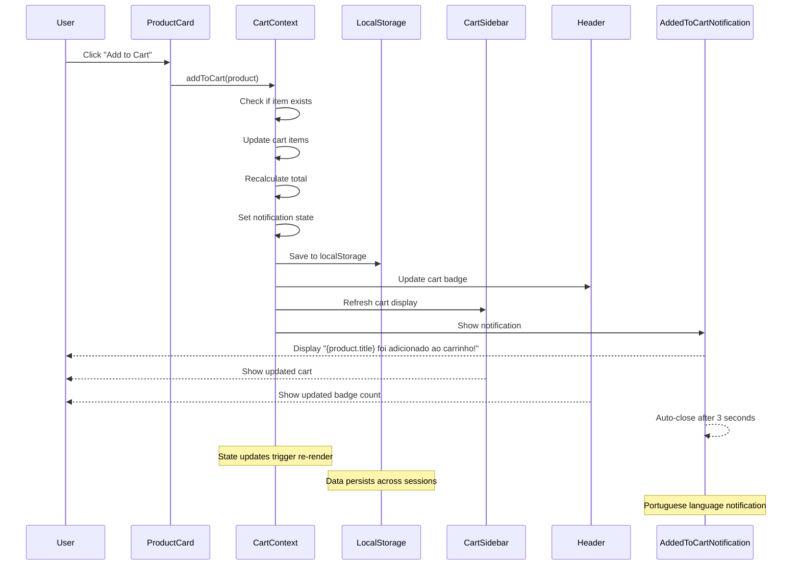

# IFMAIS Shopping Cart Application - High-Level Design

## Overview

This document outlines the high-level design for the IFMAIS shopping cart application, a React-based e-commerce platform designed for the "If Mais Empreendedor" initiative. The application provides a digital menu system enabling users to browse products, manage a shopping cart, and place orders through an intuitive web interface.

**Project Type**: Frontend React Application with TypeScript
**Target Users**: Entrepreneurs and participants in the "If Mais Empreendedor" program
**Core Purpose**: Seamless digital shopping experience for menu items

## Technology Stack & Dependencies

### Core Technologies
- **React 18+**: Component-based UI framework with hooks
- **TypeScript 5+**: Type safety and enhanced development experience  
- **Vite 5+**: Build tool and development server
- **Tailwind CSS 3+**: Utility-first styling framework

### UI Component Library
- **shadcn/ui**: Pre-built accessible UI components (Sheet, Badge, Button, Card, Dialog)
- **@radix-ui/react-***: Headless UI primitives
- **class-variance-authority (cva)**: Component variant management
- **tailwind-merge & clsx**: Class name utilities

### State Management & Persistence
- **React Context API**: Global state management for cart functionality
- **useLocalStorage Hook**: Data persistence across browser sessions

## Component Architecture

### System Architecture Overview

``mermaid
graph TB
    subgraph "Frontend Application"
        App[App.tsx]
        Home[Home.tsx]
        
        subgraph "Layout Components"
            Header[Header]
            Footer[Footer]
        end
        
        subgraph "Product Components"
            CategoryFilter[CategoryFilter]
            ProductGrid[ProductGrid]
            ProductCard[ProductCard]
        end
        
        subgraph "Cart Components"
            CartSidebar[CartSidebar]
            CartItem[CartItem]
            AddedToCartNotification[AddedToCartNotification]
        end
        
        subgraph "State Management"
            CartContext[CartContext]
            LocalStorage[useLocalStorage]
        end
        
        subgraph "Data Layer"
            ProductData[products.ts]
            CategoryData[categories.ts]
        end
        
        subgraph "UI Foundation"
            ShadcnUI[shadcn/ui Components]
            Button[Button]
            Card[Card]
            Sheet[Sheet]
            Dialog[Dialog]
            Badge[Badge]
        end
    end
    
    App --> Home
    Home --> Header
    Home --> CategoryFilter
    Home --> ProductGrid
    Home --> CartSidebar
    Home --> Footer
    
    ProductGrid --> ProductCard
    CartSidebar --> CartItem
    CartSidebar --> AddedToCartNotification
    
    Header --> CartContext
    ProductCard --> CartContext
    CartItem --> CartContext
    CartSidebar --> CartContext
    AddedToCartNotification --> CartContext
    
    CartContext --> LocalStorage
    ProductGrid --> ProductData
    CategoryFilter --> CategoryData
    
    Header --> Badge
    ProductCard --> Card
    ProductCard --> Button
    CartSidebar --> Sheet
    CartItem --> Button
    
    style CartContext fill:#bbf,stroke:#333,stroke-width:2px
    style App fill:#f9f,stroke:#333,stroke-width:2px
```

### Component Hierarchy & Responsibilities

#### Core Layout Components
- **App.tsx**: Root component providing CartContext to the application
- **Home.tsx**: Main page orchestrating product display and cart management
- **Header**: Navigation with logo and cart indicator using shadcn/ui Badge
- **Footer**: Application footer with static content

#### Product Management Components
- **ProductGrid**: Responsive grid layout displaying filtered products
- **ProductCard**: Individual product display using shadcn/ui Card component
- **CategoryFilter**: Category selection using shadcn/ui Button variants

#### Cart Management Components  
- **CartSidebar**: Side panel for cart management using shadcn/ui Sheet
- **CartItem**: Individual cart item with quantity controls
- **AddedToCartNotification**: Toast notification for successful cart additions

#### Notification Components
- **AddedToCartNotification**: User feedback component for cart operations
  - Fixed positioning at top center using memory-specified positioning
  - Auto-close functionality with 3-second timer
  - CircleCheckIcon integration from lucide-react
  - Smooth slide-in animation with Tailwind CSS
  - Portuguese language support for cart addition messages

#### State Management Layer
- **CartContext**: Centralized cart state with localStorage persistence
- **useLocalStorage**: Custom hook for browser storage synchronization

## Data Models & Type Definitions

### Core Data Structures

``mermaid
classDiagram
    class Product {
        +String id
        +String title
        +String description
        +Number price
        +String image
        +CategoryType category
        
        <<interface>>
    }
    
    class Category {
        +String id
        +String name
        +String label
        
        <<interface>>
    }
    
    class CartItem {
        +String id
        +Product product
        +Number quantity
        +Number subtotal
        
        <<interface>>
    }
    
    class CartState {
        +CartItem[] items
        +Number total
        +Boolean isOpen
        
        <<interface>>
    }
    
    class CartContextType {
        +CartItem[] items
        +Number total
        +Boolean isOpen
        +addToCart(product: Product): void
        +removeFromCart(itemId: String): void
        +updateQuantity(itemId: String, quantity: Number): void
        +clearCart(): void
        +toggleCart(): void
        
        <<interface>>
    }
    
    CartItem --> Product : contains
    CartState --> CartItem : manages
    CartContextType --> CartItem : manipulates
    CartContextType --|> CartState : extends
    
    class CategoryType {
        <<enumeration>>
        doces
        salgados
        bebidas
        sobremesas
    }
    
    Product --> CategoryType : categorized_by
```

### TypeScript Interface Definitions

```typescript
interface Product {
  id: string;
  title: string;
  description: string;
  price: number;
  image: string;
  category: 'doces' | 'salgados' | 'bebidas' | 'sobremesas';
}

interface CartItem {
  id: string;
  product: Product;
  quantity: number;
  subtotal: number;
}

interface CartContextType {
  items: CartItem[];
  total: number;
  isOpen: boolean;
  notification: {
    isVisible: boolean;
    product?: Product;
  };
  addToCart: (product: Product) => void;
  removeFromCart: (itemId: string) => void;
  updateQuantity: (itemId: string, quantity: number) => void;
  clearCart: () => void;
  toggleCart: () => void;
  hideNotification: () => void;
}

interface AddedToCartNotificationProps {
  product?: Product;
  isVisible: boolean;
  onClose: () => void;
}
```

## State Management Architecture

### CartContext Implementation Pattern

```mermaid
graph LR
    CartContext --> CartState[Cart State]
    CartContext --> CartActions[Cart Actions]
    
    CartState --> Items[items: CartItem[]]
    CartState --> Total[total: number]
    CartState --> IsOpen[isOpen: boolean]
    CartState --> Notification[notification: {isVisible, product}]
    
    CartActions --> AddToCart[addToCart]
    CartActions --> RemoveFromCart[removeFromCart]
    CartActions --> UpdateQuantity[updateQuantity]
    CartActions --> ClearCart[clearCart]
    CartActions --> ToggleCart[toggleCart]
    CartActions --> HideNotification[hideNotification]
    
    style CartContext fill:#bbf,stroke:#333,stroke-width:2px
```

### Key State Management Features
- **Centralized State**: Single source of truth for cart data
- **localStorage Persistence**: Cart state survives browser sessions
- **Automatic Calculations**: Real-time total price computation
- **Type Safety**: Comprehensive TypeScript coverage
- **Side Effect Management**: useEffect hooks for data synchronization
- **Notification System**: Integrated notification state for user feedback
- **Auto-hide Notifications**: 3-second auto-close timer for notifications

## User Interaction Flows

### Primary User Workflows



### Cart Operations Flow

``mermaid
flowchart TD
    Start([User Action]) --> AddToCart{Add to Cart?}
    AddToCart -->|Yes| CheckExists{Item Exists?}
    CheckExists -->|Yes| IncrementQty[Increment Quantity]
    CheckExists -->|No| CreateNew[Create New Item]
    IncrementQty --> UpdateSubtotal[Update Subtotal]
    CreateNew --> UpdateSubtotal
    
    AddToCart -->|No| UpdateQty{Update Quantity?}
    UpdateQty -->|Yes| ValidateQty{Quantity > 0?}
    ValidateQty -->|Yes| SetQuantity[Set New Quantity]
    ValidateQty -->|No| RemoveItem[Remove from Cart]
    SetQuantity --> UpdateSubtotal
    
    UpdateQty -->|No| RemoveAction{Remove Item?}
    RemoveAction -->|Yes| RemoveItem
    RemoveAction -->|No| ClearCart{Clear Cart?}
    ClearCart -->|Yes| EmptyCart[Empty All Items]
    
    UpdateSubtotal --> CalcTotal[Recalculate Total]
    RemoveItem --> CalcTotal
    EmptyCart --> CalcTotal
    CalcTotal --> SaveStorage[Save to localStorage]
    SaveStorage --> UpdateUI[Update UI Components]
    UpdateUI --> End([Complete])
    
    style CheckExists fill:#FFE4B5
    style CalcTotal fill:#90EE90
    style SaveStorage fill:#87CEEB
```

## Styling Strategy

### CSS Architecture Approach
- **Framework**: Tailwind CSS utility-first approach
- **Component Library**: shadcn/ui design system integration
- **Pattern**: No custom CSS modules, leveraging existing design tokens
- **Responsive Design**: Mobile-first approach using Tailwind breakpoints

### shadcn/ui Component Integration
- **Consistent Design System**: Utilizing CSS variables and design tokens
- **Accessibility Built-in**: ARIA attributes and keyboard navigation included
- **Component Variants**: Leveraging cva (class-variance-authority) for component styling
- **Theme Support**: Dark/light mode capability through CSS custom properties

## Routing & Navigation

### Application Routing Structure
- **Main Route (/)**: Home page with product catalog and cart functionality
- **Error Handling**: PageNotFound component for invalid routes
- **Future Extensions**: Prepared structure for checkout, product details, and user account pages

### Navigation Patterns
- **Single Page Application**: Primary functionality on main route
- **Modal Navigation**: Cart sidebar overlay using shadcn/ui Sheet
- **Category Navigation**: Filter-based product display without route changes

## API Integration Layer

### Current Data Architecture
- **Static Data**: TypeScript files with product and category definitions
- **Type Safety**: Strongly typed data structures with interface validation
- **Future Readiness**: Service layer interfaces prepared for backend integration

### Future API Integration Points
```
interface ProductService {
  getProducts(): Promise<Product[]>;
  getProductsByCategory(category: string): Promise<Product[]>;
  getProductById(id: string): Promise<Product>;
}

interface OrderService {
  submitOrder(order: Order): Promise<OrderResponse>;
  getOrderStatus(orderId: string): Promise<OrderStatus>;
}
```

## Business Logic & Rules

### Core Business Rules
1. **Cart Item Uniqueness**: Each product exists once in cart with quantity tracking
2. **Price Calculation**: Automatic subtotal and total computation
3. **Quantity Validation**: Positive integers only, zero quantity removes item
4. **Category Classification**: Products must belong to predefined categories
5. **Data Persistence**: Cart state must survive browser refresh

### Validation & Error Handling
- **Input Validation**: Quantity must be positive integers
- **Storage Errors**: Graceful localStorage failure handling
- **State Consistency**: Automatic error recovery and state synchronization
- **User Feedback**: AddedToCartNotification component for immediate visual feedback
- **Conditional Rendering**: Notifications only show when product is available and visibility is true
- **Auto-cleanup**: Notification timers are properly cleared to prevent memory leaks

## Testing Strategy

### Testing Architecture
- **Unit Tests**: Individual component and function testing
- **Integration Tests**: Context provider and component interaction testing  
- **E2E Tests**: Critical user flows (add to cart, checkout process)
- **Type Testing**: TypeScript compilation validates type contracts

### Key Testing Scenarios
1. **Cart Operations**: Add, update, remove, clear cart functionality
2. **Category Filtering**: Product filtering and display logic
3. **Data Persistence**: localStorage synchronization and restoration
4. **UI Interactions**: Modal dialogs, sidebar, and responsive behavior
5. **Notification System**: AddedToCartNotification display, auto-close, and state management
6. **Error Handling**: Network failures, storage errors, invalid inputs
7. **Internationalization**: Portuguese language notification messages

### Testing Tools & Framework
- **Jest**: Unit testing framework
- **React Testing Library**: Component testing utilities
- **Cypress/Playwright**: End-to-end testing capabilities
- **TypeScript**: Compile-time type validation
