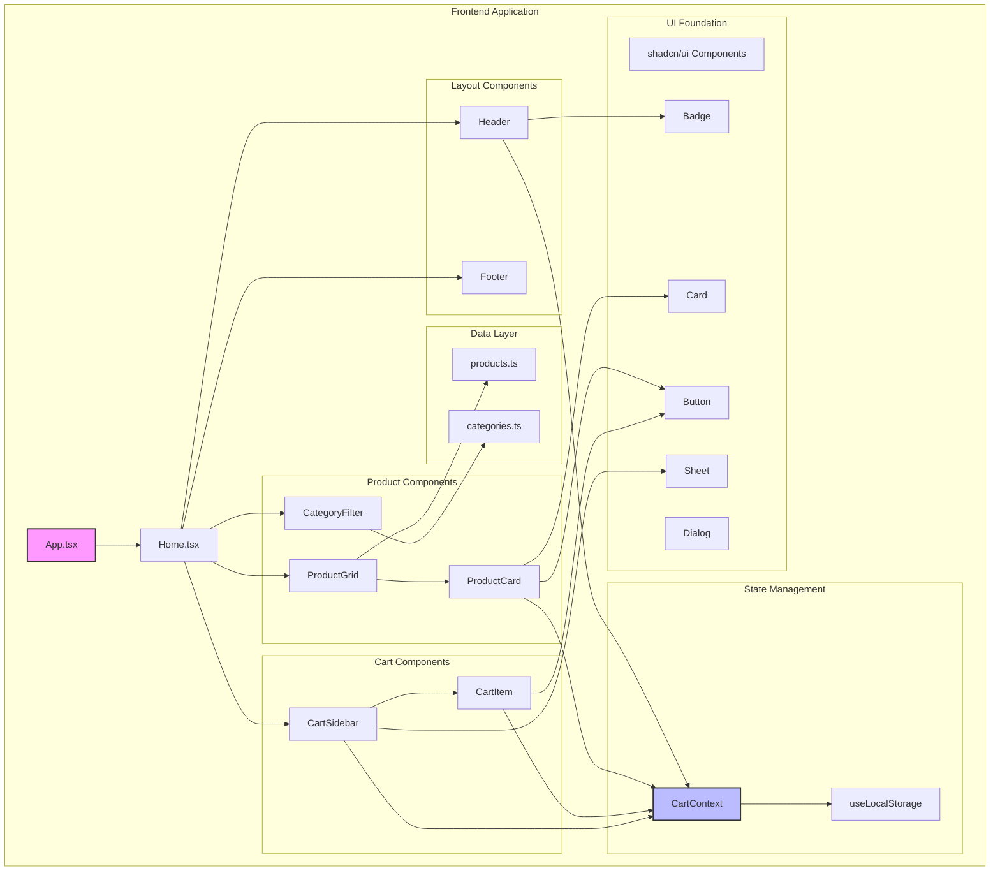
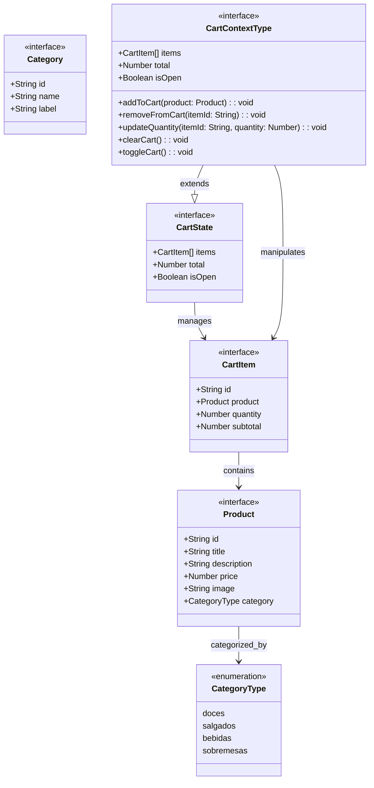
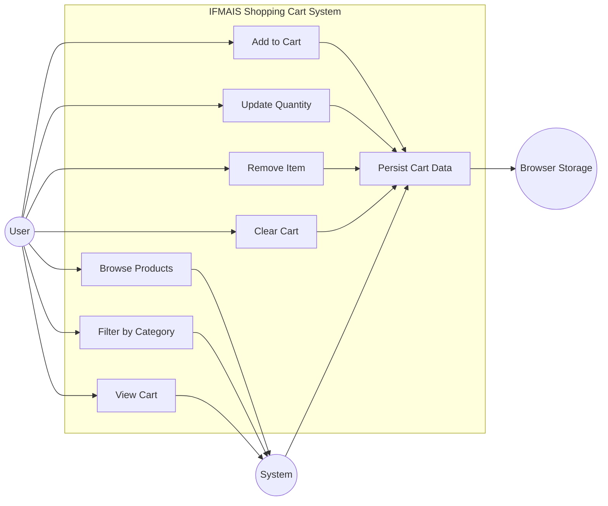
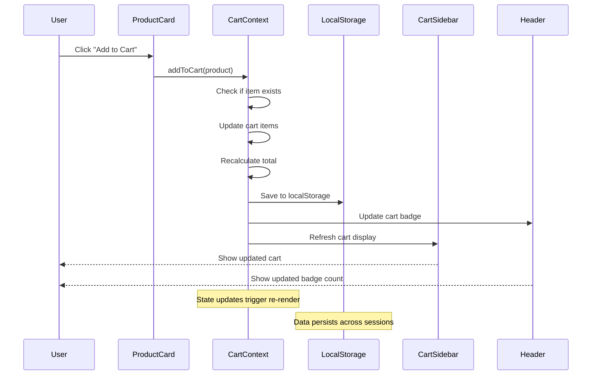
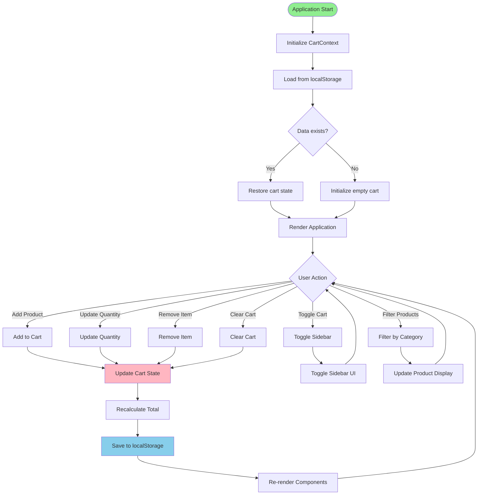
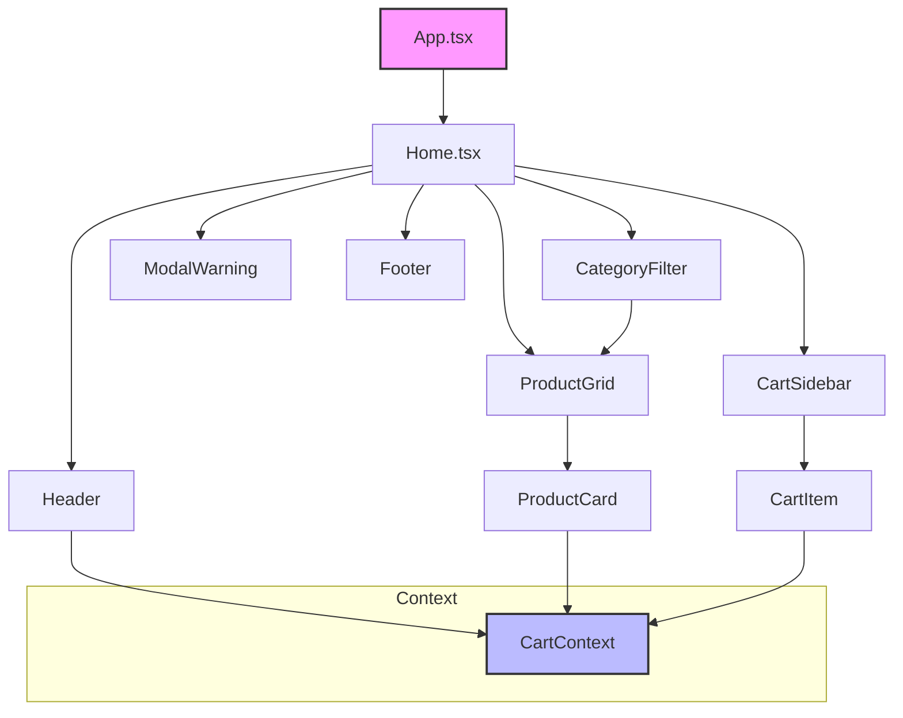

# Shopping Cart Application - Requirements Specification

## Overview

This document outlines the functional and non-functional requirements for the IFMAIS shopping cart application, a React-based digital menu system designed for the "If Mais Empreendedor" initiative. The application enables users to browse products, manage a shopping cart, and place orders through an intuitive web interface.

### Project Context
- **Current State**: Fully implemented React application with TypeScript
- **Target Users**: Entrepreneurs and participants in the "If Mais Empreendedor" program
- **Primary Goal**: Provide a seamless digital shopping experience for menu items

## Functional Requirements

### FR-001: Product Catalog Management
**Description**: The system shall display a catalog of available products organized by categories.

**Acceptance Criteria**:
- Display products with image, title, description, and price
- Support product categorization (Doces, Salgados, Bebidas, Sobremesas)
- Allow filtering products by category
- Show "Todos" option to display all products
- Maintain responsive grid layout across devices

**Priority**: High
**Source**: Product catalog data from `/src/data/products.ts`

### FR-002: Shopping Cart Operations
**Description**: Users shall be able to add, remove, and modify items in their shopping cart.

**Acceptance Criteria**:
- Add products to cart with single click
- Increment quantity for existing items
- Remove individual items from cart
- Update item quantities manually
- Clear entire cart
- Display real-time cart total
- Show cart item count in header badge

**Priority**: High
**Source**: CartContext implementation

### FR-003: Cart Sidebar Interface
**Description**: The system shall provide a slide-out sidebar for cart management.

**Acceptance Criteria**:
- Open/close cart sidebar with smooth animation
- Display all cart items with product details
- Show quantity controls for each item
- Calculate and display subtotals and total
- Provide checkout and clear cart actions
- Handle empty cart state appropriately

**Priority**: High
**Source**: CartSidebar component using shadcn/ui Sheet

### FR-004: Data Persistence
**Description**: Cart contents shall persist across browser sessions.

**Acceptance Criteria**:
- Save cart state to localStorage
- Restore cart contents on page reload
- Maintain data integrity across sessions
- Handle localStorage errors gracefully

**Priority**: Medium  
**Source**: useLocalStorage hook implementation

### FR-005: Category Filtering
**Description**: Users shall be able to filter products by category.

**Acceptance Criteria**:
- Display category filter buttons
- Highlight active category
- Filter products based on selected category
- Show all products when "Todos" is selected
- Maintain filter state during navigation

**Priority**: Medium
**Source**: CategoryFilter component

### FR-006: Responsive Design
**Description**: The application shall provide optimal user experience across all device sizes.

**Acceptance Criteria**:
- Adapt layout for mobile, tablet, and desktop
- Maintain usability on screens from 320px to 1920px
- Optimize touch interactions for mobile devices
- Ensure readable text and accessible buttons

**Priority**: High
**Source**: Tailwind CSS responsive utilities

## Non-Functional Requirements

### NFR-001: Performance
**Description**: The application shall provide fast and responsive user interactions.

**Requirements**:
- Initial page load time < 3 seconds
- Cart operations response time < 100ms
- Smooth animations (60fps)
- Efficient re-rendering with React optimization

**Measurement**: Performance testing and monitoring
**Priority**: High

### NFR-002: Usability
**Description**: The application shall be intuitive and easy to use.

**Requirements**:
- Consistent design language using shadcn/ui components
- Clear visual feedback for user actions
- Accessible keyboard navigation
- Touch-friendly interface for mobile devices
- Maximum 3 clicks to complete any action

**Measurement**: User testing and accessibility audits
**Priority**: High

### NFR-003: Reliability
**Description**: The application shall handle errors gracefully and maintain data integrity.

**Requirements**:
- Graceful error handling for localStorage failures
- Fallback mechanisms for missing data
- Consistent state management across components
- No data loss during normal operations

**Measurement**: Error monitoring and testing
**Priority**: Medium

### NFR-004: Maintainability
**Description**: The codebase shall be maintainable and extensible.

**Requirements**:
- TypeScript for type safety
- Component-based architecture
- Separation of concerns (UI, state, data)
- Comprehensive documentation
- Consistent code formatting with ESLint

**Measurement**: Code quality metrics and developer feedback
**Priority**: Medium

### NFR-005: Compatibility
**Description**: The application shall work across modern browsers and devices.

**Requirements**:
- Support for Chrome 90+, Firefox 88+, Safari 14+, Edge 90+
- Mobile compatibility (iOS Safari, Android Chrome)
- Progressive Web App capabilities
- Accessibility compliance (WCAG 2.1 AA)

**Measurement**: Cross-browser testing
**Priority**: Medium

### NFR-006: Scalability
**Description**: The application architecture shall support future growth.

**Requirements**:
- Modular component structure
- Easy integration with backend APIs
- Support for additional product categories
- Extensible state management pattern

**Measurement**: Architecture review and load testing
**Priority**: Low

## UML Diagrams

### System Architecture - Component Diagram



### Data Model - Class Diagram



### User Interaction - Use Case Diagram



### State Management - Sequence Diagram



### Component Lifecycle - Activity Diagram



## Technology Stack & Dependencies

### Core Technologies
- **React 18+**: Component-based UI framework with hooks
- **TypeScript 5+**: Type safety and enhanced development experience
- **Vite 5+**: Build tool and development server
- **Tailwind CSS 3+**: Utility-first styling framework

### UI Component Library
- **shadcn/ui**: Pre-built accessible UI components
- **@radix-ui/react-***: Headless UI primitives
- **class-variance-authority (cva)**: Component variant management
- **tailwind-merge & clsx**: Class name utilities

### State Management
- **React Context API**: Global state management for cart functionality
- **Custom Hooks**: useLocalStorage for data persistence

### Development Tools
- **ESLint**: Code linting and quality assurance
- **TypeScript Config**: Multiple config files for different environments
- **Vite Config**: Build and development configuration

## Business Rules and Constraints

### BR-001: Cart Item Uniqueness
**Rule**: Each product can only exist once in the cart as a CartItem, with quantity determining the amount.
**Implementation**: CartContext checks for existing items before adding new ones.

### BR-002: Price Calculation
**Rule**: Item subtotal = quantity × product price; Cart total = sum of all subtotals.
**Implementation**: Automatic calculation in CartContext with real-time updates.

### BR-003: Quantity Validation
**Rule**: Quantity must be positive integer; setting quantity to 0 removes the item.
**Implementation**: updateQuantity method validates input and calls removeFromCart when quantity ≤ 0.

### BR-004: Category Classification
**Rule**: Products must belong to one of four categories: doces, salgados, bebidas, sobremesas.
**Implementation**: TypeScript union type constraint in Product interface.

### BR-005: Data Persistence
**Rule**: Cart state must survive browser refresh and session changes.
**Implementation**: useLocalStorage hook automatically syncs cart state with browser storage.

## Technical Constraints

### TC-001: Browser Support
**Constraint**: Must support modern browsers with ES2020+ features.
**Impact**: Limits use of cutting-edge JavaScript features.

### TC-002: TypeScript Strict Mode
**Constraint**: All code must pass TypeScript strict compilation.
**Impact**: Requires comprehensive type definitions and null checking.

### TC-003: Responsive Design
**Constraint**: Must work on screens from 320px to 1920px width.
**Impact**: Requires careful CSS grid and flexbox implementation.

### TC-004: Performance Budget
 **Constraint**: Bundle size should remain under 500KB gzipped.
**Impact**: Careful dependency selection and code splitting strategies.

### TC-005: Accessibility Standards
**Constraint**: Must meet WCAG 2.1 AA accessibility guidelines.
**Impact**: Requires semantic HTML, ARIA attributes, and keyboard navigation support.

## Security Considerations

### SC-001: Client-Side Data Storage
**Risk**: localStorage is accessible to any script on the domain.
**Mitigation**: Only store non-sensitive cart data; no personal or payment information.

### SC-002: XSS Prevention
**Risk**: Dynamic content rendering could introduce XSS vulnerabilities.
**Mitigation**: React's built-in XSS protection; validate all user inputs.

### SC-003: Content Security Policy
**Risk**: External image sources could pose security risks.
**Mitigation**: Implement CSP headers for production deployment.

## Integration Points

### IP-001: Future Backend API
**Description**: Application designed for easy integration with REST APIs.
**Preparation**: 
- Service layer interfaces defined
- Async/await patterns ready for implementation
- Error handling structure in place

### IP-002: Payment Processing
**Description**: Checkout functionality prepared for payment gateway integration.
**Preparation**:
- Order data structure defined
- Cart state easily serializable
- Clear separation between cart and order flow

### IP-003: Analytics Integration
**Description**: User interaction tracking for business intelligence.
**Preparation**:
- Event-driven architecture
- Clear action definitions in CartContext
- User journey clearly defined

## Quality Assurance

### QA-001: Testing Strategy
**Unit Tests**: Individual component and function testing
**Integration Tests**: Context provider and component interaction testing
**E2E Tests**: Critical user flows (add to cart, checkout process)

### QA-002: Code Quality
**Linting**: ESLint configuration with TypeScript rules
**Formatting**: Consistent code style across the project
**Type Safety**: Comprehensive TypeScript coverage

### QA-003: Performance Monitoring
**Bundle Analysis**: Regular bundle size monitoring
**Runtime Performance**: React DevTools profiling
**User Experience**: Core Web Vitals monitoring

## Component Architecture

### Component Hierarchy



### Component Definitions

#### 1. Header Component
**Purpose**: Top navigation with logo and cart indicator
**Props Interface**:
```typescript
interface HeaderProps {
  className?: string;
}
```
**Key Features**:
- Logo display
- Cart icon with item count badge using shadcn/ui Badge
- Responsive design
- Integration with CartContext for real-time updates

#### 2. CartSidebar Component
**Purpose**: Side panel for cart management using shadcn/ui Sheet
**Props Interface**:
```typescript
interface CartSidebarProps {
  isOpen: boolean;
  onClose: () => void;
}
```
**Key Features**:
- Slide-in/out animation with Sheet component
- Cart items list rendering
- Total calculation display
- Checkout button
- Empty cart state handling

#### 3. CartItem Component
**Purpose**: Individual cart item representation
**Props Interface**:
```typescript
interface CartItemProps {
  item: CartItemType;
  onUpdateQuantity: (id: string, quantity: number) => void;
  onRemove: (id: string) => void;
}
```
**Key Features**:
- Product image display
- Title and price information
- Quantity controls using shadcn/ui Button components
- Remove item functionality
- Real-time price calculation

#### 4. CategoryFilter Component
**Purpose**: Product category filtering controls
**Props Interface**:
```typescript
interface CategoryFilterProps {
  categories: Category[];
  activeCategory: string;
  onCategoryChange: (category: string) => void;
}
```
**Key Features**:
- Button group for categories (Todos, Doces, Salgados, Bebidas, Sobremesas)
- Active state management using Button variants
- Responsive button layout

#### 5. ProductGrid Component
**Purpose**: Product display grid with filtering
**Props Interface**:
```typescript
interface ProductGridProps {
  products: Product[];
  activeCategory: string;
}
```
**Key Features**:
- Responsive grid layout with Tailwind classes
- Category-based filtering
- Product card rendering
- Loading states

#### 6. ProductCard Component
**Purpose**: Individual product display using shadcn/ui Card
**Props Interface**:
```typescript
interface ProductCardProps {
  product: Product;
  onAddToCart: (product: Product) => void;
}
```
**Key Features**:
- Product image display within Card component
- Title and price information
- Add to cart button
- Hover effects and interactions

#### 7. ModalWarning Component
**Purpose**: Warning dialogs using shadcn/ui Dialog
**Props Interface**:
```typescript
interface ModalWarningProps {
  isOpen: boolean;
  onClose: () => void;
  message: string;
  type?: 'warning' | 'error' | 'info';
}
```
**Key Features**:
- Overlay backdrop with Dialog component
- Configurable message content
- Close button functionality
- Escape key handling (built into Dialog)

#### 8. Footer Component
**Purpose**: Application footer content
**Props Interface**:
```typescript
interface FooterProps {
  className?: string;
}
```
**Key Features**:
- Static content display
- Responsive layout
- Future extensibility for dynamic content

### State Management Architecture

#### CartContext Implementation

```mermaid
graph LR
    CartContext --> CartState[Cart State]
    CartContext --> CartActions[Cart Actions]
    
    CartState --> Items[items: CartItem[]]
    CartState --> Total[total: number]
    CartState --> IsOpen[isOpen: boolean]
    
    CartActions --> AddToCart[addToCart]
    CartActions --> RemoveFromCart[removeFromCart]
    CartActions --> UpdateQuantity[updateQuantity]
    CartActions --> ClearCart[clearCart]
    CartActions --> ToggleCart[toggleCart]
    
    style CartContext fill:#bbf,stroke:#333,stroke-width:2px
```

**CartContext Interface**:
```typescript
interface CartContextType {
  // State
  items: CartItem[];
  total: number;
  isOpen: boolean;
  
  // Actions
  addToCart: (product: Product) => void;
  removeFromCart: (itemId: string) => void;
  updateQuantity: (itemId: string, quantity: number) => void;
  clearCart: () => void;
  toggleCart: () => void;
}
```

**Key Features**:
- Centralized cart state management
- localStorage persistence
- Automatic total calculation
- Side effects handling with useEffect
- Type-safe operations

### Data Models

#### Product Interface
```typescript
interface Product {
  id: string;
  title: string;
  price: number;
  image: string;
  category: 'doces' | 'salgados' | 'bebidas' | 'sobremesas';
}
```

#### CartItem Interface
```typescript
interface CartItem {
  id: string;
  product: Product;
  quantity: number;
  subtotal: number;
}
```

#### Category Interface
```typescript
interface Category {
  id: string;
  name: string;
  label: string;
}
```

## Styling Strategy

### CSS Architecture
- **Current**: Global CSS with manual class management
- **Target**: Tailwind CSS utility classes with shadcn/ui components
- **Pattern**: Utility-first approach leveraging existing design system
- **No CSS Modules**: Pure Tailwind classes and shadcn/ui component styling

### Component Styling Patterns
Following the existing button component pattern with shadcn/ui:
```typescript
// Using existing button variants from shadcn/ui
const cardVariants = cva(
  "rounded-lg border bg-card text-card-foreground shadow-sm",
  {
    variants: {
      size: {
        default: "p-6",
        sm: "p-4",
        lg: "p-8"
      },
      variant: {
        default: "border-border",
        elevated: "shadow-lg",
        outlined: "border-2"
      }
    },
    defaultVariants: {
      size: "default",
      variant: "default"
    }
  }
)
```

### Shadcn/UI Integration
- **Leverage existing components**: Button, Card, Badge, Dialog, Sheet components from shadcn/ui
- **Consistent design tokens**: Using CSS variables and design system tokens
- **Accessibility built-in**: Shadcn/ui components include ARIA attributes and keyboard navigation

## Application Structure

### File Organization

```
src/
├── components/
│   ├── ui/
│   │   ├── button.tsx              # Existing shadcn/ui component
│   │   ├── card.tsx                # Shadcn/ui card component (available)
│   │   ├── dialog.tsx              # Shadcn/ui modal component (available)
│   │   ├── badge.tsx               # Shadcn/ui badge component (available)
│   │   └── sheet.tsx               # Shadcn/ui sheet component for sidebar (available)
│   ├── layout/
│   │   ├── Header.tsx
│   │   └── Footer.tsx
│   ├── cart/
│   │   ├── CartSidebar.tsx
│   │   └── CartItem.tsx
│   ├── product/
│   │   ├── ProductGrid.tsx
│   │   ├── ProductCard.tsx
│   │   └── CategoryFilter.tsx
│   └── common/
│       └── ModalWarning.tsx
├── context/
│   └── CartContext.tsx
├── data/
│   ├── products.ts                 # Product data (no compilation needed)
│   └── categories.ts               # Category definitions
├── hooks/
│   ├── useCart.ts                  # Cart-related custom hooks
│   └── useLocalStorage.ts          # LocalStorage persistence hook
├── types/
│   ├── product.ts                  # Product type definitions
│   └── cart.ts                     # Cart type definitions
├── lib/
│   └── utils.ts                    # Existing utility functions (cn, etc.)
├── pages/
│   ├── Home.tsx                    # Main shopping page
│   ├── MainApp.tsx                 # Existing main app
│   └── PageNotFound.tsx            # Existing 404 page
├── App.tsx
└── main.tsx
```

## API Integration Layer

### Current Data Source
- **Current**: Static HTML with JavaScript arrays
- **Migration**: TypeScript data files with proper typing

### Future API Integration Points
```typescript
// Future API service structure
interface ProductService {
  getProducts(): Promise<Product[]>;
  getProductsByCategory(category: string): Promise<Product[]>;
  getProductById(id: string): Promise<Product>;
}

interface OrderService {
  submitOrder(order: Order): Promise<OrderResponse>;
  getOrderStatus(orderId: string): Promise<OrderStatus>;
}
```

## Testing Strategy

### Component Testing Approach
- **Unit Tests**: Individual component testing with Jest and React Testing Library
- **Integration Tests**: Context provider and component interaction testing
- **E2E Tests**: Critical user flows (add to cart, checkout process)

### Key Testing Scenarios
1. **Cart Operations**:
   - Add product to cart
   - Update item quantity
   - Remove item from cart
   - Clear entire cart

2. **Category Filtering**:
   - Filter products by category
   - Display all products
   - Handle empty filter results

3. **Modal Interactions**:
   - Display warning when cart is empty
   - Close modal on button click
   - Close modal on escape key

4. **Persistence**:
   - Cart state persistence in localStorage
   - Cart state restoration on page reload

### Testing File Structure
```
src/
├── __tests__/
│   ├── components/
│   │   ├── Header.test.tsx
│   │   ├── CartSidebar.test.tsx
│   │   ├── ProductCard.test.tsx
│   │   └── CategoryFilter.test.tsx
│   ├── context/
│   │   └── CartContext.test.tsx
│   └── utils/
│       └── cart-utils.test.tsx
```

## Migration Implementation Plan

### Phase 1: Foundation Setup
1. ✅ All required shadcn/ui components are already available (Card, Dialog, Badge, Sheet)
2. Set up TypeScript interfaces and types
3. Create basic component structure using existing shadcn/ui components
4. Implement CartContext with basic functionality

### Phase 2: Core Components with Shadcn/UI
1. Migrate Header component using shadcn/ui Badge for cart count
2. Implement ProductCard using shadcn/ui Card component
3. Create ProductGrid with responsive Tailwind grid classes
4. Implement CategoryFilter with shadcn/ui Button variants

### Phase 3: Cart Management with Shadcn/UI
1. Implement CartSidebar using shadcn/ui Sheet component
2. Create CartItem component with shadcn/ui Button controls
3. Add cart persistence with localStorage hooks
4. Implement ModalWarning using shadcn/ui Dialog component

### Phase 4: Enhancement & Testing
1. Refine responsive design with Tailwind utilities
2. Implement comprehensive testing suite
3. Performance optimization
4. Accessibility validation (built into shadcn/ui)

### Phase 5: Integration & Deployment
1. Integrate all components in main React application
2. Final testing and bug fixes
3. Documentation updates
4. React app deployment (no compilation needed for data files)